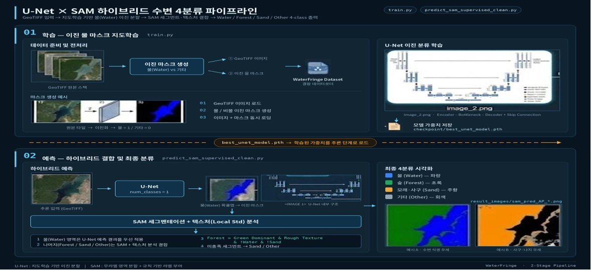
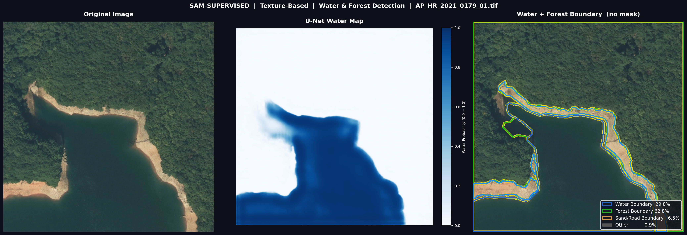
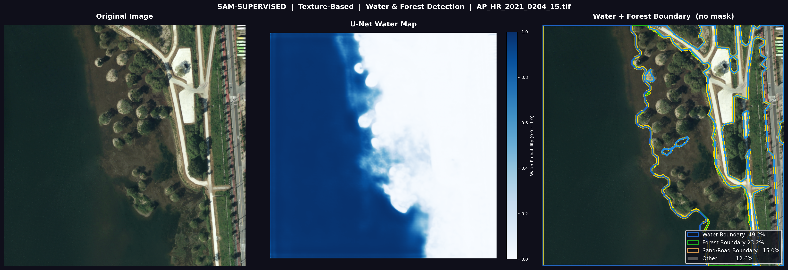
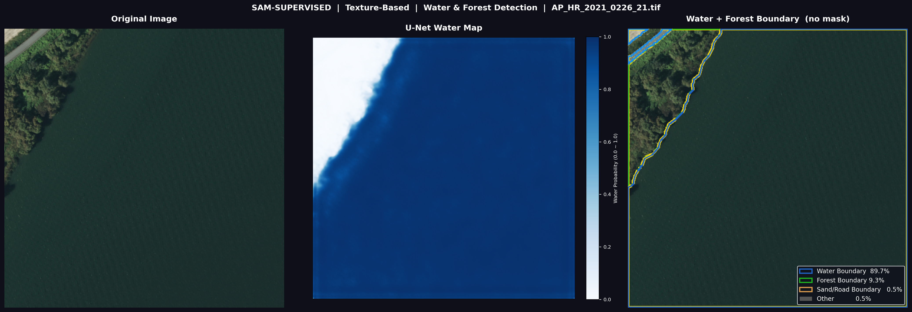
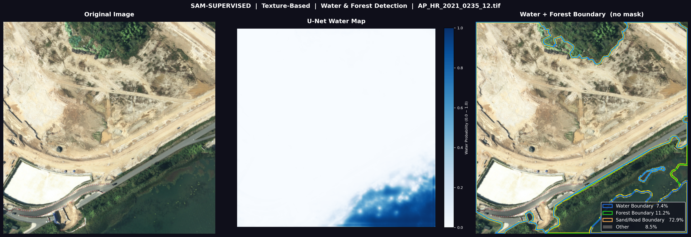
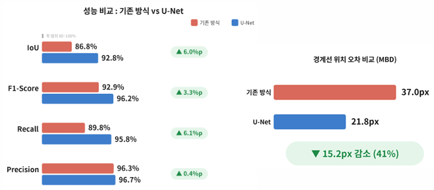
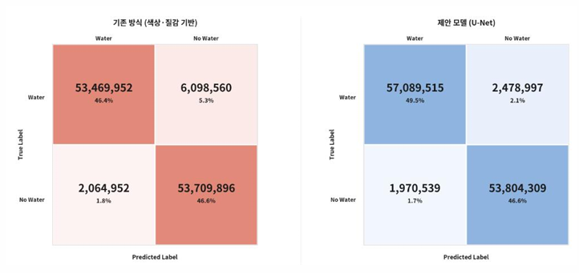

# 한강 수변구역 4분류 세그멘테이션 (U-Net × SAM Hybrid)

한강 유역 고해상도 항공 영상(GeoTIFF)에서 **물(Water) · 숲(Forest) · 모래사장/나지(Sand) · 기타(Other)** 4가지 지형을 픽셀 단위로 분류하는 2단계 하이브리드 파이프라인입니다.

---

## 파이프라인 구조



**1단계 — U-Net 이진 물 마스크 학습 (`train.py`)**: GeoTIFF 원본과 이진 물 마스크(Water vs 기타)로 U-Net을 지도학습하여 `best_unet_model.pth`를 저장합니다.

**2단계 — 하이브리드 예측 (`predict_sam_supervised_clean.py`)**: 학습된 U-Net으로 물(Water) 영역을 먼저 확정한 뒤, 나머지 영역은 SAM 세그멘테이션 + 로컬 표준편차 텍스처 분석과 RGB 조건식을 결합해 숲/모래사장/기타로 순차 분류합니다.

---

## 예측 결과 예시

각 예시는 원본 영상, U-Net 물 확률맵(Water Map), 물/숲/모래·도로 경계 오버레이 결과를 나란히 보여줍니다.










---

## 성능 비교: 기존 방식(색상·질감 기반) vs 제안 모델(U-Net)

| 지표 | 기존 방식 | U-Net | 개선폭 |
|---|---|---|---|
| IoU | 86.8% | 92.8% | ▲ 6.0%p |
| F1-Score | 92.9% | 96.2% | ▲ 3.3%p |
| Recall | 89.8% | 95.8% | ▲ 6.1%p |
| Precision | 96.3% | 96.7% | ▲ 0.4%p |
| 경계선 위치 오차 (MBD) | 37.0px | 21.8px | ▼ 15.2px (41% 감소) |



### 혼동행렬(Confusion Matrix) 비교



U-Net 적용 시 Water/No-Water 오분류(위양성·위음성) 픽셀 수가 기존 색상·질감 기반 방식 대비 모두 감소했습니다. 특히 실제 Water를 No-Water로 놓치는 위음성이 6,098,560 → 2,478,997픽셀로 크게 줄어, 경계 누락 없이 수역을 탐지하는 성능이 개선되었습니다.

---

## 기술 스택

- Python, PyTorch (U-Net)
- - SAM (Segment Anything Model)
  - - 데이터: AI-Hub 한강 유역 항공 영상 837쌍 (Train 639 / Val 198), 25cm 해상도
   
    - ## 프로젝트 구조
   
    - ```text
      .
      ├── train.py                          # 1단계: U-Net 이진 물 마스크 학습
      ├── predict_sam_supervised_clean.py   # 2단계: 하이브리드 예측 및 4분류
      ├── predict_sam_heuristic.py          # 휴리스틱 기반 예측 비교군
      ├── evaluate.py                       # 정량 평가
      ├── plot_metrics.py                   # 성능 지표 시각화
      ├── src/                              # 모델·데이터셋 정의
      └── result_images/                    # 파이프라인 다이어그램 및 결과 시각화
      ```
      
